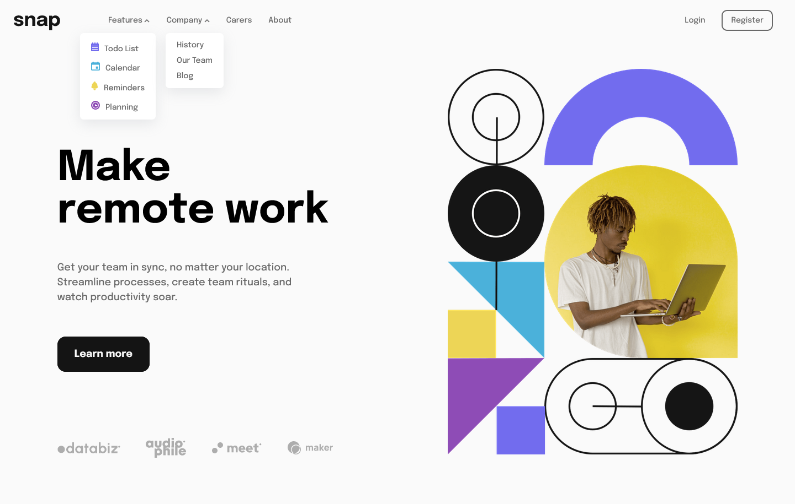
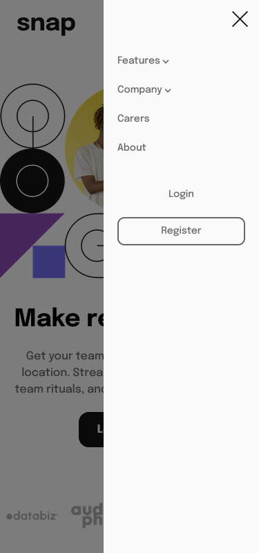
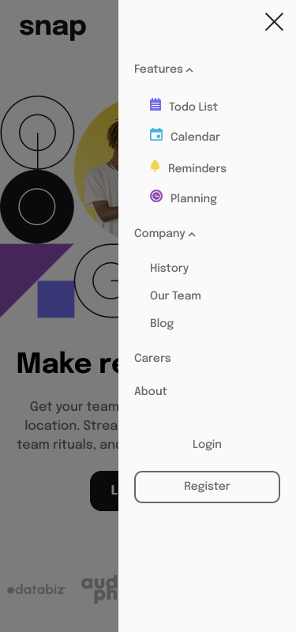

# Frontend Mentor - Intro section with dropdown navigation solution

This is a solution to the [Intro section with dropdown navigation challenge on Frontend Mentor](https://www.frontendmentor.io/challenges/intro-section-with-dropdown-navigation-ryaPetHE5). Frontend Mentor challenges help you improve your coding skills by building realistic projects. 

## Table of contents

- [Overview](#overview)
  - [The challenge](#the-challenge)
  - [Screenshot](#screenshot)
  - [Links](#links)
- [My process](#my-process)
  - [Built with](#built-with)
  - [Notes](#notes)
- [Author](#author)

## Overview

### The challenge

Users should be able to:

- View the relevant dropdown menus on desktop and mobile when interacting with the navigation links
- View the optimal layout for the content depending on their device's screen size
- See hover states for all interactive elements on the page

### Screenshot

### Links

- Solution URL: [Github](https://github.com/Sebitass47/intro-section-with-dropdown-navigation)
- Live Site URL: [Github Pages](http://sebitass47.github.io/intro-section-with-dropdown-navigation)

## My process

### Built with

- [React](https://reactjs.org/) - JS library
- CSS custom properties
- Flexbox

### Notes

The website is only designed for screen sizes from 1080px to 1440px and from 340px to 600px, it is not designed for tablets

## Author

- Website - [Sebastián Martínez de la Rosa](https://sebitass47.com)
- Frontend Mentor - [@Sebitass47](https://www.frontendmentor.io/profile/Sebitass47)

